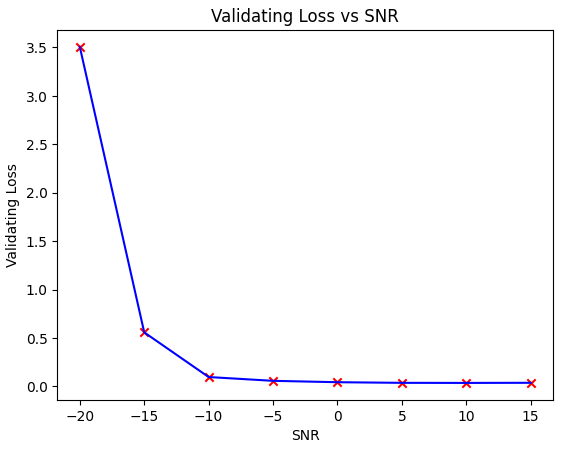

  

<h1 align="center">Morse Code Decoder & Detector with Deep Learning</h1>
<h2 align="center">Final project for the Technion's EE Deep Learning course (046211)</h2> 

## Table of Contents
1. [Background](#background)
2. [Summary](#summary)
3. [Models Overview](#models-overview)  
   3.1 [LSTM RNN - Decoder](#lstm-rnn)  
   3.2 [Faster RCNN RESNET50 - Detection](#faster-rcnn-resnet)
5. [Demo](#demo-lstm--resnet)
6. [Refrences](#refrences)
7. [Contributers](#contributers)
   
## Background

Morse code detection methods have evolved from DSP techniques requiring prior signal knowledge to robust deep learning models like YOLO, addressing issues in traditional time-frequency analysis-based approaches. In this project, we build a DNN to detect morse code in a spectrogram, utilizing the latest advances in Deep Learning object detection and classification. This is a challenging task, as real-world data contains pink\white noise, interferences, and distortions. We investigated two architectures (`LSTM-RNN`, `Faster-RCNN`). Multiple approaches have been taking on this task in the past, but focused on those architectures and pipeline that reflect as many techniques from the course as possible, aiming for the object-detection-approach. The variance in labeld morse code data that are needed is hard to come by, thus we synthesized new labeled bursts of morse CW signals. We tested our network output with common metrics in communication decoding, such as a variant of `CER` (Character Error Rate) vs `SNR` (Signal-to-Noise-Ratio).
The results demonstrate the effectiveness of these approaches in decoding and detection morse code from spectrograms.

## Summary
* **General**
    * Implementation in pytorch
    * Digital signal processing from scratch
    * Generating training samples (morse signals -> spectrogram) on-the-fly with various hyperparameters
    * Morse signals varies in `pitch` (main frequency), `length` (number of chars), `signal amplitude`, noise amplitude (`SNR` [dB] (-10dB, 10dB)), morse `dit\dah` length**
    * Used `TensorBoard` for local training tracking
    
* **Part 1: LSTM-RNN morse decoder**
    * input: spectrogram [shape: (dynamic, 21)] + target string, output: string
    * Model size: `740,395 parameters`
    * trained on ~50,000,000 morse chars
    * `Average CER (Character Error Rate) <2%` on SNR above -5dB
    * loss function: CTCLoss
        * The Connectionist Temporal Classification loss. Calculates loss between a continuous (unsegmented) time series and a target sequence.
    * Train loss after 4k epoches ~0.15
    * Fixed vs Dynamic pitch (main frequency) - training on fixed frequency has performed better in evaluation
       
* **Part 2: FASTER RCNN ([resnet50](https://pytorch.org/vision/main/models/generated/torchvision.models.resnet50.html)) morse detector**
    * input: spectrogram [shape: (dynamic, 21)] , output: bounding box, scores, labels
    * Bounding box prediction
    * Trained on ~1,000,000 spectrogram's
    * Model size:
        * Total number of parameters: `41,299,161`
        * Number of trainable parameters: 41,076,761
    * Accuracy: `IoU-x axis 97%`
    * loss function: [RPN Loss Function](https://towardsdatascience.com/review-faster-r-cnn-object-detection-f5685cb30202), combines:
        * classification loss over 2 classes
        * regression loss of bounding boxes
    * Train loss: 0.12, Validation loss: 0.3  

## Models Overview
### LSTM RNN

#### Motiviation
Long Short-Term Memory (LSTM) is a type of Recurrent Neural Network (RNN) architecture that has been widely used for sequence-to-sequence tasks, such as machine translation, speech recognition, and, in our case, decoding Morse code from a spectrogram.

* **Spectrogram Representation**  
Before feeding the data into the LSTM, we need to represent the Morse code signal as a spectrogram. A spectrogram is a visual representation of the spectrum of frequencies in a signal as they vary with time. It is a 2D image-like representation, where the x-axis represents time, the y-axis represents frequency, and the intensity of each pixel represents the energy or amplitude of the signal at that particular time and frequency.

* **LSTM Architecture**  
The LSTM network is designed to process sequential data, such as the spectrogram representation of Morse code. It consists of a series of interconnected memory cells, which are capable of maintaining and updating their internal state over time. This allows the LSTM to selectively remember or forget information from previous time steps, making it well-suited for tasks that require long-term dependencies.
Our LSTM architecture typically consists of the following components:    1. **Input Layer**: This layer receives the input data, which in our case is the spectrogram of the Morse code signal.  2. 3 More **Dense Layers**   3. Dropuout Layer after most of the Dense Layers   4. **LSTM Layer**: One LSTM layer to process the input sequence   5. **Output Layer**: The final layer produces the predicted output sequence, which is the decoded text.

* **Training and Decoding**  
During training, the LSTM network is fed with pairs of spectrogram representations and their corresponding text transcriptions. The network learns to map the input spectrograms to the correct text sequences by adjusting its weights and biases through backpropagation and optimization algorithms like stochastic gradient descent.
During decoding (inference), the trained LSTM model takes a new spectrogram as input and generates the predicted text sequence by iteratively processing the input and updating its internal state. Techniques like beam search or greedy decoding can be employed to find the most likely text sequence given the input spectrogram.

* **Advantages of LSTM for Morse Code Decoding**
LSTM networks are well-suited for decoding Morse code from spectrograms due to the following reasons:
1. **Sequence Processing**: LSTM can handle variable-length input sequences, making it suitable for processing Morse code signals of different durations.
2. **Long-Term Dependencies**: LSTM can capture long-term dependencies in the input data, which is important for correctly decoding Morse code characters that may be separated by various timing gaps.
3. **Robustness to Noise**: LSTM networks can learn to be robust to noise and variations in the input data, which is crucial for decoding Morse code signals that may be corrupted by environmental factors or imperfect transmission.

Overall, the LSTM architecture, combined with the spectrogram representation of Morse code signals, provides a powerful and effective approach for decoding Morse code sequences from audio or radio signals.

#### Metrics
* **The Connectionist Temporal Classification loss**  
Calculates loss between a continuous (unsegmented) time series and a target sequence. CTCLoss sums over the probability of possible alignments of input to target, producing a loss value which is differentiable with respect to each input node. The alignment of input to target is assumed to be “many-to-one”, which limits the length of the target sequence such that it must be ≤ the input length.

  

* **CER (Character Error Rate)**  
The Character Error is the percentage of characters that have been transcribed incorrectly by the Text Recognition model. For example, a 5% CER means that the text model has automatically transcribed correctly 95 characters out of 100, while it has misread only 5 characters.
We incoprated [Levenshtein Distance](https://en.wikipedia.org/wiki/Levenshtein_distance) as our CER 

  

#### Results
| Training Loss (first 1000 epochs) |
|---|
||

| Validation Loss vs SNR | Validate CER vs SNR |
|---|---|
| |  |

| Training Loss (higher epochs) |
|---|
||

| CER Loss (higher epochs) |
|---|
||

### Faster RCNN (resnet)

#### Motiviation
Faster R-CNN (Faster Regions with Convolutional Neural Networks) is an object detection algorithm that builds upon the success of its predecessors, R-CNN and Fast R-CNN. It was introduced in the 2015 paper ["Faster R-CNN: Towards Real-Time Object Detection with Region Proposal Networks"](https://arxiv.org/abs/1506.01497) by Shaoqing Ren, Kaiming He, Ross Girshick, and Jian Sun.

The key innovation in Faster R-CNN is the introduction of a **Region Proposal Network** (RPN), which is a fully convolutional network that generates region proposals (bounding boxes) for objects in the input image. This contrasts with previous approaches that relied on external region proposal algorithms like selective search, which were computationally expensive and slow.

The Faster R-CNN architecture consists of two main components:
1. **Region Proposal Network (RPN)**: This is a lightweight convolutional neural network that takes an input image and outputs a set of object proposals or regions of interest (RoIs). The RPN works by sliding a small window over the input feature map and outputting multiple region proposals for each window location. These proposals are then filtered and ranked based on their objectness score, which is the probability that a region contains an object of interest.

2. **Object Detection Network**: This is a Fast R-CNN network that takes the proposed RoIs from the RPN and performs object classification and bounding box regression. It extracts features from each RoI using a RoI pooling layer and then passes these features through fully connected layers to predict the class and refine the bounding box coordinates.

The key advantages of Faster R-CNN are:
1. **Speed**: By integrating the region proposal step into the network, Faster R-CNN can process images much faster than its predecessors, enabling real-time object detection.
2. **Accuracy**: The RPN and the shared convolutional features used for both region proposal and object detection improve the overall accuracy of the system.
3. **End-to-End Training**: The entire Faster R-CNN network can be trained end-to-end, making the training process more efficient and effective.

Faster R-CNN has been widely adopted and has inspired numerous subsequent object detection algorithms, such as Mask R-CNN for instance segmentation and RetinaNet for dense object detection.

We will use 'fasterrcnn_resnet50_fpn' varient (original model), read more here ["PyTorch FASTER R-CNN"](https://pytorch.org/vision/0.16/models/faster_rcnn.html)

#### Metrics
* **IoU (Intersection over Union)**  
IOU measures the overlap between the predicted region and the ground truth region, helping to quantify how well an algorithm’s output aligns with the actual object or region in the image.
Our focus is to detect the start and end of data in the signal frame. Thus, we focus on x-axis accuracy using a custom IoU metric we call IoU-x.

  

#### Results
| Training Loss (first 500 epochs) |
|---|
||

| IoU Loss vs SNR |
|---|
||

# Demo (LSTM + RESNET)
| pitch: 950, wpm: 18, snrDB: 0, amplitude: 154, str: MORSE DL, bbx: (17, 19, 242, 20) |
|---|
||

## Files In The Repository
|File name| Purpsoe|
|---------------------------------------------------------------|-----------------------------------------------------------------|
|`morse-decoder-detector-dl.ipynb`| Includes morse generator, LSTM+RESNET training\validation\evaluation and DEMO|
| `./models`| Saved `LSTM` checkpoints (small size)|
| `./assets`| for readme|

## Prerequisites
|Library         | Version |
|--------------------|----|
|`Python`| `3.9.0 (Anaconda3)`|
|`matplotlib`| `3.7.0`|
|`numpy`| `1.23.4`|
|`torch`| `2.1.0+cu121`|
|`torchvision`| `0.16.0+cu121`|
|`scipy`| `1.10.1`|
|`Levenshtein`| `0.25.0`|
|`tqdm`| `4.66.1`|
|`tqdm`| `4.66.1`|

### Run The Models
Everything you need is in the notebook. Head over to the demo part (after imports) and checkout the models performance.

## Refrences

* [Ham Radio Blog by AG1LE](https://ag1le.blogspot.com/2019/02/performance-characteristics-of-ml-morse.html)
* Ling YOU, Weihao LI, Wenlin ZHANG, Keren WANG. Automatic Decoding Algorithm of Morse Code Based on Deep Neural Network[J]. Journal of Electronics & Information Technology, 2020, 42(11): 2643-2648. doi: 10.11999/JEIT190658. [link](https://jeit.ac.cn/en/article/doi/10.11999/JEIT190658#:~:text=A%20deep%20learning%20method%20is,end%2Dto%2Dend%20training.)
* Research on Automatic Decoding of Morse Code Based on Deep Learning.” 2019 International Conference on Intelligent Computing, Automation and Systems (ICICAS) (2019): 488-491. [link](https://sci-hub.se/10.1109/icicas48597.2019.00107)

## Contributers
### Authors
*Maor Assayag* [<a href="https://www.linkedin.com/in/maorassayag/">LinkedIn</a>, <a href="https://github.com/MaorAssayag">GitHub</a>]  
B.Sc Computer Engineering, Ben-gurion University, Israel  
M.Sc Marine Technologies, University of Haifa, Israel

*Eliraz Kadosh*  [<a href="https://www.linkedin.com/in/eliraz-kadosh/">LinkedIn</a>, <a href="https://github.com/ElirazKadosh">GitHub</a>]  
B.Sc Electrical and Computer Engineering, Technion, Israel  

*Eliram Amrusi*  [<a href="https://www.linkedin.com/in/eliram-amrusi-11b949258/">LinkedIn</a>, <a href="https://github.com/EliramAmrusi">GitHub</a>]  
B.Sc Electrical and Computer Engineering, Technion, Israel  

### Supervisors
Prof. *Daniel Soudry* and TA *Tal Daniel*  
Electrical and Computer Engineering Department, Technion, Israel
